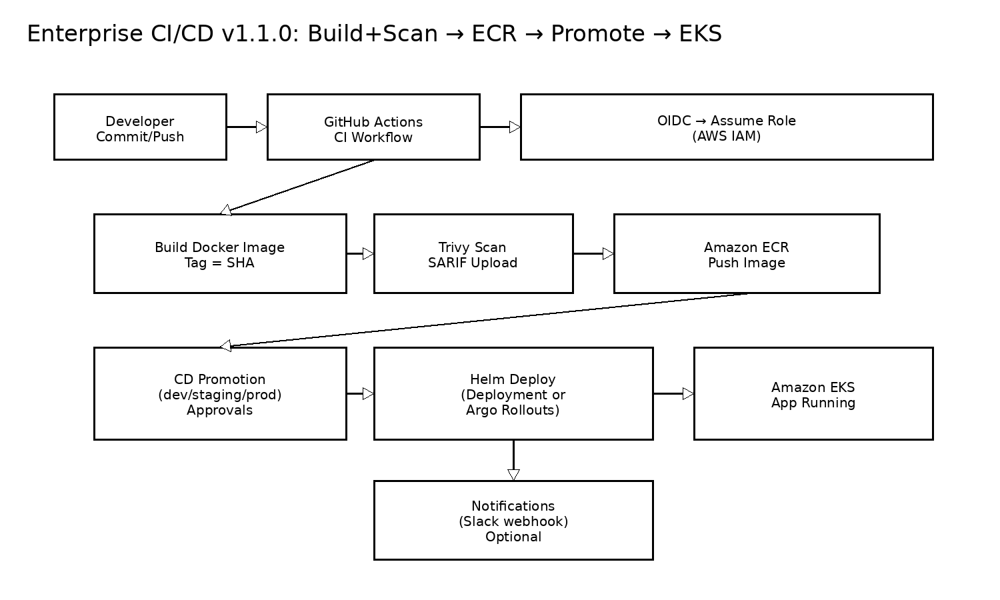
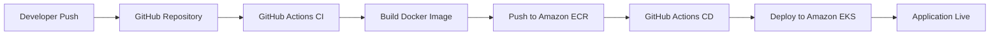

<!-- ELITE ANIMATED BANNER -->

  

<!-- TYPING ANIMATION -->

  

---

<!-- BADGES -->

  
  
  
  
  
  
  
  

---

# Enterprise CI/CD Pipeline

Production-grade CI/CD pipeline implementing modern DevOps and platform engineering practices using GitHub Actions, Terraform, Docker, Amazon ECR, and Amazon EKS.

---

# DevOps Stack

  

---

# Architecture Overview

  

---

# Pipeline Flow

---

# Enterprise Features

- Secure OIDC authentication (no AWS keys)
- Fully automated CI/CD pipeline
- Infrastructure as Code (Terraform)
- Docker containerization
- Kubernetes deployment using Helm
- Amazon ECR container registry
- Amazon EKS orchestration
- Security scanning with Trivy
- Environment promotion support
- Production-grade rollback capability

---

# DevOps Capabilities Demonstrated

| Capability | Implementation |
|----------|----------------|
| CI/CD Automation | GitHub Actions |
| Infrastructure Automation | Terraform |
| Containerization | Docker |
| Container Registry | Amazon ECR |
| Kubernetes Deployment | Helm + EKS |
| Authentication | OIDC |
| Security Scanning | Trivy |
| Deployment Strategy | Rolling / Canary Ready |

---

# GitHub Stats (Elite Portfolio Feature)

  
  

---

# Author

  

<strong>Olusegun Mayungbe</strong> 
DevOps Engineer | Platform Engineer | Kubernetes | Terraform | AWS

  
  

---

  

